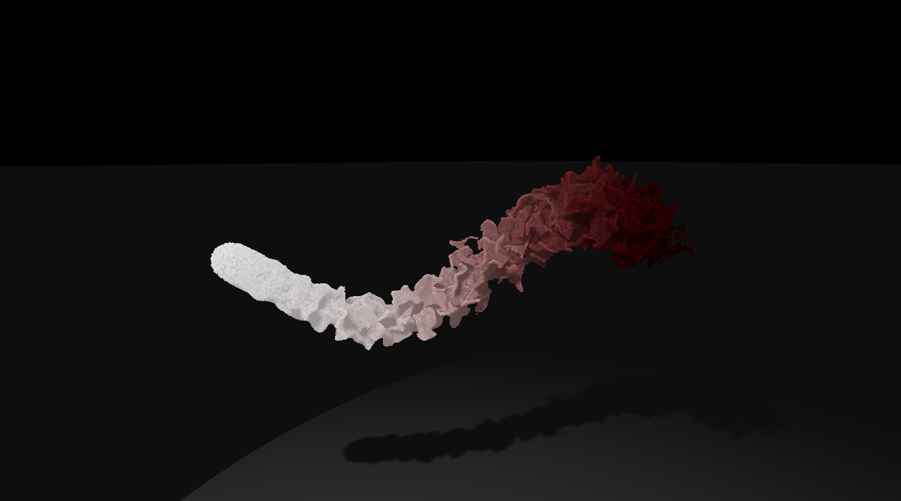

# Shader Particle Engine 2

An experiment to push as much of a particle engine's computation onto the GPU. Makes use of 3 DataTextures (spawn, velocity, and position), each one containing all the points for each created emitter.

## What can it do?

The image below is 900,000 particles, rendered as GL Points, being modified using simplex noise, and supporting lighting and both casting and receiving shadows. So stuff like that, really.

## Usage

As this is currently in development, and very much still in the "sketching" / testing out the system architecture phase, there's no hosted version, so:

1. Check out the repo
2. `yarn` or `npm i`
3. `yarn dev` or `npm run dev`
4. Open browser

----

### Pipeline

At a high-level, the pipeline for this project is relatively simple:

> Emitters -> GPGPU Calculation -> Renderer(s)

##### Details

* Emitters can each have their own spawn, velocity, and position data.
* The GPGPU Calculation phase uses the GLSL shaders to calculate the DataTextures
* The Renderer (of which there are two: PointsRenderer and MeshRenderer) takes these
  DataTextures and uses them to draw either GL points or 3d meshes.
